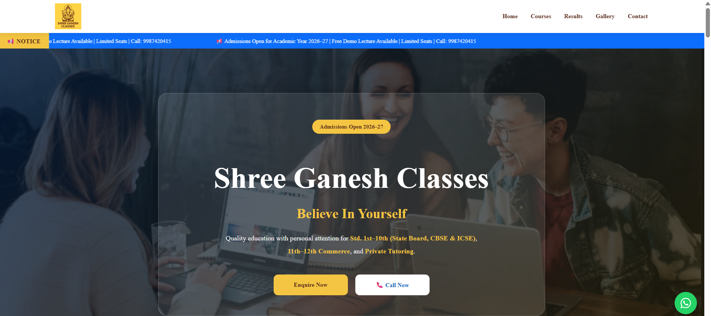

# 🎓 Shree Ganesh Classes – Modern Coaching Institute Website

A modern, responsive, and SEO-friendly website developed for **Shree Ganesh Classes**, a coaching institute in Mumbai. The website is built using **React** and **Vite**, providing students and parents with a clean, fast, and user-friendly experience across desktop, tablet, and mobile devices.

---

## 🌐 Project Overview

The website showcases the coaching institute's:

- 📚 Courses Offered
- 🏆 Student Results
- 👨‍🏫 Faculty Information
- 📸 Interactive Gallery
- 📞 Contact Information
- 💬 WhatsApp Integration

The project focuses on modern UI/UX, responsiveness, accessibility, and performance.

---

## ✨ Features

- 🎨 Modern and clean UI
- 📱 Fully Responsive (Desktop, Tablet & Mobile)
- 🖼️ Interactive Gallery with Lightbox
- 📞 Click-to-Call Support
- 💬 WhatsApp Quick Chat
- 📌 Sticky Navigation Bar
- 🚀 Smooth Animations
- 🔍 SEO Optimized
- ♿ Accessibility Improvements
- ⚡ Fast Production Build with Vite

---

## 🛠️ Technologies Used

- React
- Vite
- JavaScript (ES6+)
- HTML5
- CSS3
- React Icons

---

## 📂 Project Structure

```text
src/
│
├── assets/
├── components/
├── data/
├── gallery/
├── App.jsx
├── main.jsx
│
public/
│
├── logo.png
├── favicon.svg
```

---

## 📱 Responsive Design

The website is optimized for:

- 💻 Desktop
- 💼 Laptop
- 📱 Tablet
- 📲 Mobile Devices

---

## ⚡ Performance & Accessibility

### Lighthouse Results

| Category | Score |
|-----------|------:|
| Performance (Desktop) | 94 |
| Accessibility | 90+ |
| Best Practices | 100 |
| SEO | 92 |

---

## 🚀 Getting Started

### Clone the repository

```bash
git clone https://github.com/CodeCraftsman297/sgc-website.git
```

### Navigate to the project

```bash
cd sgc-website
```

### Install dependencies

```bash
npm install
```

### Start development server

```bash
npm run dev
```

### Build for production

```bash
npm run build
```

### Preview production build

```bash
npm run preview
```

---

## 📸 Screenshot



---

## 🌍 Live Demo

🔗 https://sgc-website-five.vercel.app

---

## 🔮 Future Improvements

- Online Admission Form
- Testimonials Section
- Student Portal
- Notes Download Section
- Online Fee Enquiry
- Blog & Announcements
- Admin Dashboard

---

## 👨‍💻 Developer

**Nishant Khetal**

GitHub: https://github.com/CodeCraftsman297

---

## 📄 License

This project is developed for **Shree Ganesh Classes** for educational and business purposes.

---

⭐ If you like this project, consider giving it a **Star** on GitHub!